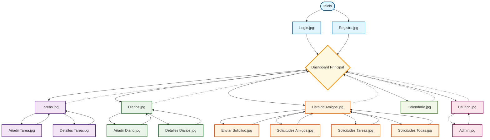

# Diagrama de Flujo - Task Craft (Prototipos)

## Descripción de los Flujos

### 🔐 Auth Flow (Flujo de Autenticación)
- **Login.jpg**: Página de inicio de sesión
- **Registro.jpg**: Página de registro de nuevos usuarios

### 📊 Dashboard Flow (Flujo Principal)
El dashboard actúa como hub central que conecta con todos los módulos:

#### 📝 Tasks Flow (Flujo de Tareas)
- **Tareas.jpg**: Lista principal de tareas
- **Añadir Tarea.jpg**: Formulario para crear nueva tarea
- **Detalles Tarea.jpg**: Vista detallada de una tarea específica

#### 📖 Diaries Flow (Flujo de Diarios)
- **Diarios.jpg**: Lista principal de entradas de diario
- **Añadir Diario.jpg**: Formulario para crear nueva entrada
- **Detalles Diarios.jpg**: Vista detallada de una entrada específica

#### 👥 Friends Flow (Flujo de Amigos)
- **Lista de Amigos.jpg**: Lista de amigos del usuario
- **Enviar Solicitud.jpg**: Enviar solicitud de amistad
- **Solicitudes Amigos.jpg**: Gestionar solicitudes de amistad
- **Solicitudes Tareas.jpg**: Gestionar solicitudes relacionadas con tareas
- **Solicitudes Todas.jpg**: Vista unificada de todas las solicitudes

#### 📅 Calendar Flow (Flujo de Calendario)
- **Calendario.jpg**: Vista de calendario con eventos y tareas

#### ⚙️ User Settings Flow (Flujo de Configuración)
- **Usuario.jpg**: Configuración del perfil de usuario
- **Admin.jpg**: Panel de administración (para usuarios admin)

## Leyenda de Colores
- 🔵 **Azul**: Flujo de Autenticación
- 🟣 **Púrpura**: Flujo de Tareas
- 🟢 **Verde**: Flujo de Diarios
- 🟠 **Naranja**: Flujo de Amigos
- 🔴 **Rosa**: Configuración de Usuario
- 🟡 **Amarillo**: Dashboard Principal
- 🌿 **Verde Claro**: Calendario

Las líneas punteadas (-.->)  representan la navegación de retorno al dashboard principal desde cualquier sección.

